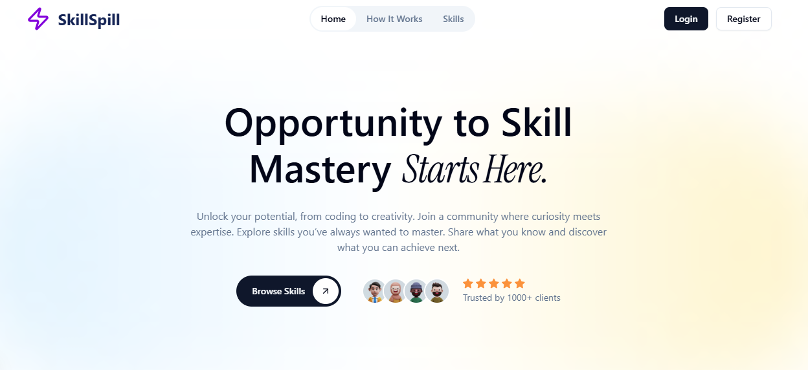

<!-- contain instructions for running, building and deploying the application -->

# SkillSpill

**SkillSpill – Unlock your potential, from coding to creativity.**  
Join a community where curiosity meets expertise. Explore skills you’ve always wanted to master. Share what you know and discover what you can achieve next. Completely free – no money involved; just share your skills and learn from others.

---



## Overview

**SkillSpill** is a free skill exchange platform where users can:

1. **Share their skills** with the community
2. **Learn new skills** from others
3. **Book sessions** and review experiences

The platform is designed for **simplicity and engagement**, allowing users to focus purely on learning and teaching skills, without any monetary transactions.

---

## How to Run Locally

This project is built with **Next.js 16**, **TypeScript**, and **Shadcn**. Follow these steps to set up and run it locally:

### 1. Install Node.js & npm

Download and install Node.js (which includes npm) from [nodejs.org](https://nodejs.org).

### 2. Clone the Repository

```bash
git clone <your-repo-url>
cd PROJECT_FOLDER
3. Install Dependencies
npm install
4. Run Development Server
npm run dev

Open http://localhost:3000
 to view the app locally.
```

## Project Structure ::

### Authentication Pages:

| Page            | Path                                  |
| --------------- | ------------------------------------- |
| Forgot Password | `app/(auth)/forgot-password/page.tsx` |
| Login           | `app/(auth)/login/page.tsx`           |
| Register        | `app/(auth)/register/page.tsx`        |

### Dashboard Pages:

| Section          | Path                                                                               |
| ---------------- | ---------------------------------------------------------------------------------- |
| Dashboard Layout | `app/dashboard/layout.tsx`                                                         |
| Dashboard Home   | `app/dashboard/page.tsx`                                                           |
| Bookings         | `app/dashboard/bookings/page.tsx` <br> `app/dashboard/bookings/layout.tsx`         |
| Browse Skills    | `app/dashboard/browse-skill/page.tsx` <br> `app/dashboard/browse-skill/layout.tsx` |
| Profile          | `app/dashboard/profile/layout.tsx` <br> `app/dashboard/profile/page.tsx`           |
| Reviews          | `app/dashboard/reviews/page.tsx` <br> `app/dashboard/reviews/layout.tsx`           |
| Skill Details    | `app/dashboard/skill-details/[id]/page.tsx`                                        |
| Skills           | `app/dashboard/skills/layout.tsx` <br> `app/dashboard/skills/page.tsx`             |
| Submit Skill     | `app/dashboard/submit-skill/layout.tsx` <br> `app/dashboard/submit-skill/page.tsx` |

### Landing Pages:

| Page           | Path                                                 |
| -------------- | ---------------------------------------------------- |
| Home / Landing | `app/landing/layout.tsx` <br> `app/landing/page.tsx` |
| Landing Skill  | `app/landing/skill/[id]/page.tsx`                    |

## Future Roadmap:

1:Refactor code to avoid repetition and improve maintainability

2:Integrate Strapi backend for dynamic data management

3:Add more features as defined in the final prototype

4:Enhance UI/UX and add advanced dashboard analytics

### Conclusion:

This project is a completely free skill exchange platform that allows users to share their skills and learn new ones without any monetary transactions. Built using Next.js and TypeScript, it features a clean and modern design. The project is still in development, but it has a solid foundation that can be expanded with more features in the future.

### Student Details

- Student Name: Hira Khan
- VuId: BC210423704
- Supervisor: Amjad Iqbal Khan
